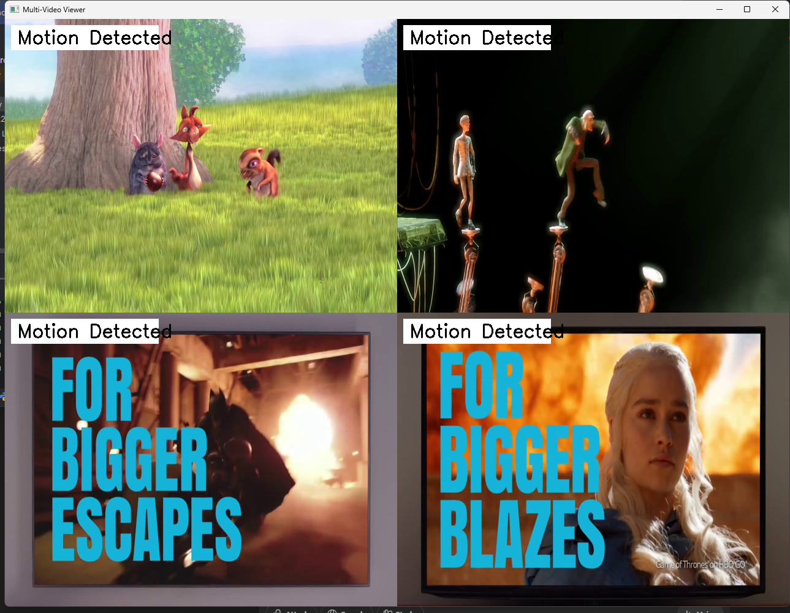

# 📹 OpenCV Week 2 - Multi‑Stream RTSP Viewer with Motion and Camera Compromise Detection

This project is the official submission for **Week 2** of the OpenCV real‑time streaming and processing challenge.  
The goal is to build a system that displays **four real‑time video streams** (simulated RTSP feeds), detects motion, and identifies whether the camera feed is blurred, covered, or compromised.
---

## 📌 Project Description

This application mimics a **real‑time CCTV system** that:
- Streams video from **four different cameras** in parallel  
- Detects **motion** in each camera using background subtraction  
- Detects **tampering** (blurred, covered, or laser interference) using image analysis  
- Displays the 4 video streams in a **2×2 grid** window  
- Shows alerts like **“Motion Detected”** or **“Camera Compromised”** as overlay text  

This system can be easily adapted for **real RTSP cameras**, surveillance systems, or home security.
---

## 🗂️ Project Structure

opencv-week2/
├── code/
│ └── multi_stream_viewer.py # Main implementation file
├── report/
│ └── week2_report.md # Detailed explanation and findings
├── diagrams/
│ └── screenshot_output.png # Screenshot of the 2×2 viewer
└── README.md # You are here


---

## 🔧 Requirements

You need Python and OpenCV. Install dependencies using pip:

```bash
pip install opencv-python numpy

---

## 🛠️ How to Run

### 🔁 Step‑by‑Step Instructions

1. **Clone the Repository** or download ZIP:

```bash
git clone https://github.com/<your-username>/opencv-week2.git
cd opencv-week2/code

---

## 🔍 Features Explained

### 🎥 1. Multi‑Stream RTSP Viewer (4 Cameras)

- Uses **Python threading** to fetch frames from 4 streams concurrently.  
- Prevents UI blocking or lag.  
- Automatically loops `.mp4` test streams or attempts reconnection for RTSP.

### 🔄 2. Real‑Time Motion Detection

- Utilizes `cv2.createBackgroundSubtractorMOG2` for motion detection.  
- If movement is detected, draws a white rectangle with **“Motion Detected”** in black text.

### 🛑 3. Camera Tamper Detection

Checks for compromised video feed in two ways:

#### a. **Blur Detection**  
- Uses the Laplacian variance metric.  
- If sharpness (variance) is below a threshold (e.g., 100), the frame is considered blurred.

#### b. **Cover / Laser / Overexposure Detection**  
- Uses the grayscale histogram.  
- If 95% or more of pixels are the same value (uniform distribution), then it is considered covered or overexposed.

If compromise is detected, draws a red rectangle with **“Camera Compromised”** overlay.

### 🧱 4. 2×2 Video Grid Display

- Resizes all frames to the same size (e.g., 640×480).  
- Combines them into a grid using `np.hstack()` and `np.vstack()`.  
- Maintains alignment and consistent layout.

---

## 🖼️ Example Output Screenshot

Here’s what your viewer will look like:

> 🔲 Top‑left, Top‑right, Bottom‑left, Bottom‑right  
> ✅ Motion detected or compromise warnings may appear overlayed.




---

## 🧾 Summary of Methods Used

| Task | Method / Technique |
|------|--------------------|
| Multi‑Stream Handling | `threading.Thread`, thread‑safe capture |
| Motion Detection | `cv2.createBackgroundSubtractorMOG2` + thresholding |
| Blur Detection | `cv2.Laplacian()` variance |
| Cover Detection | Histogram analysis via `cv2.calcHist()` |
| Video Display | `cv2.resize()`, `np.hstack()`, `np.vstack()` |
| Overlay Text & Boxes | `cv2.putText()`, `cv2.rectangle()` |

---

## 🧠 Learnings & Insights

- RTSP / video streams can be **unstable**; reconnection logic is important.  
- Motion detection may have **false positives**, so you need to **tune thresholds**.  
- Tamper detection (blur, cover) is essential in surveillance setups.  
- Using multithreading with OpenCV is effective for handling multiple streams in real time.

---

## 🧰 Troubleshooting Guide

| Problem | Likely Cause | Solution |
|--------|----------------|----------|
| Only 2 out of 4 videos show | URLs invalid or stream failing | Check URL or internet, enable logs |
| One window black or blank | That stream failed reading frames | Visual placeholder is shown for diagnostics |
| Motion always triggered (false positive) | Too low threshold | Increase motion threshold or filter noise |
| Frequent “Camera Compromised” alerts | Too strict thresholds | Relax blur/histogram thresholds or conditions |

---


